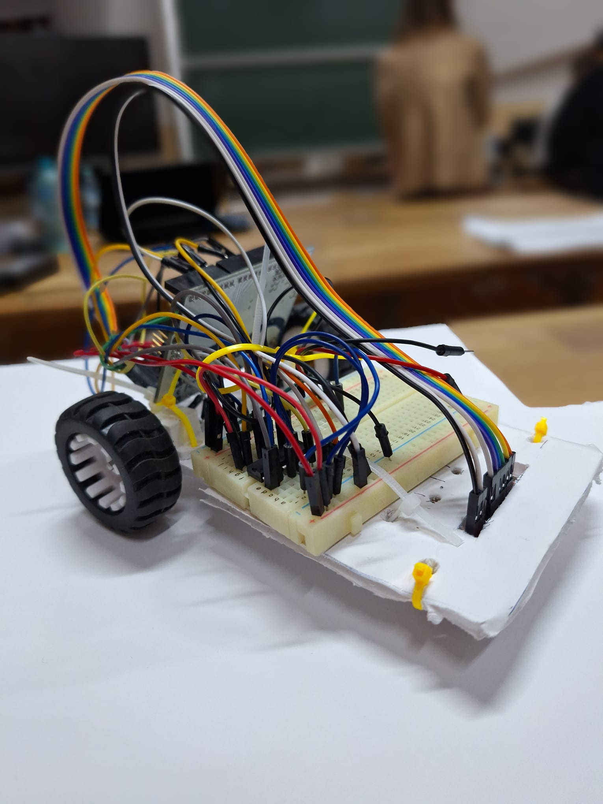
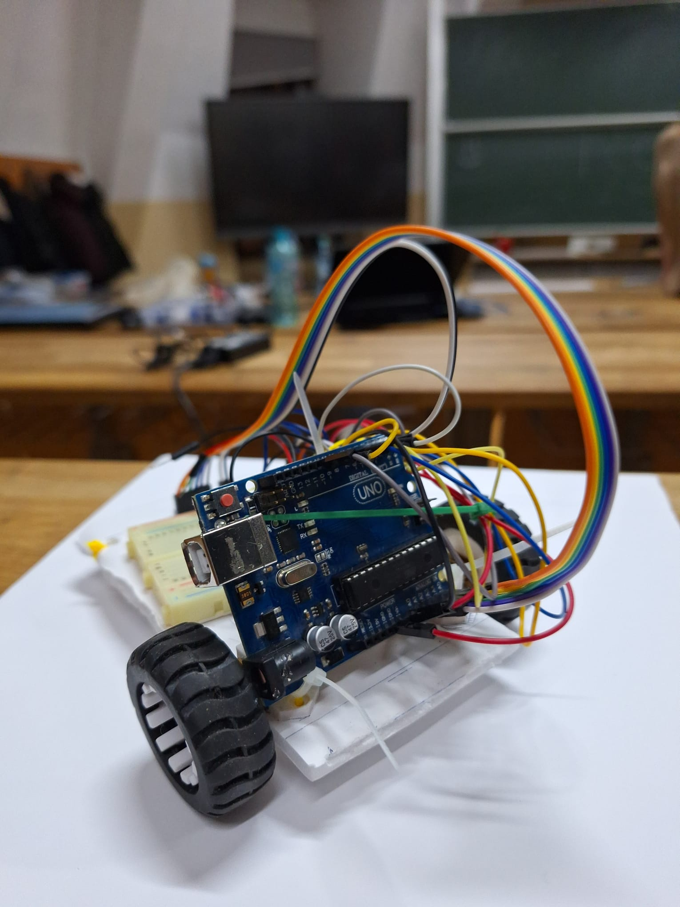

# Pathfinders' Line follower - Introduction To Robotics (2023-2024)

Cloned repo: [ralexgt/Pathfinders-Linefollower](https://github.com/ralexgt/Pathfinders-Linefollower/blob/main/code/linefollower.ino)
 

  Project description 📚

&nbsp;&nbsp;&nbsp;&nbsp; We were asked to design, build and code a line follower during a hackathon held by our Introduction To Robotics professor at the University of Bucharest. Teams consisted of around 3 students and we had to build a good enough line follower, capable of completing a predefined course in a limited time.

 

  Members 🙆‍♂️

- Păun Ștefan
- Vlad Bogdan
- Roman Alex

 

  Project implementation 🔧

&nbsp;&nbsp;&nbsp;&nbsp; At the beggining of the hackathon we focused strictly on the hardware part. We started by designing our chassis on a white cardboard, noting each component and marking as close as possible where we wanted everything to be and making a good image of the finished robot.  
&nbsp;&nbsp;&nbsp;&nbsp; After which we cut the cardboard to make our chassis, put each component in place using screws or zip ties and connected everything with wires from the arduino to the L293D motor driver on a medium breadboard and from a QTR-8A reflectant sensor to the arduino.  
&nbsp;&nbsp;&nbsp;&nbsp; Finishing the hardware part of the line follower, we moved on to software. We scripted the first version of the code, implementing the PID control and through testing making sure our robot can finish in decent time a course. We then followed up with an automatic calibration function (before we had to manually calibrate the sensors each time we had a test run) and continued with tests and improvements until we got a satisfying time.

 

  Components ⚙️

- Arduino Uno
- Medium Breadboard
- Wires as needed
- L293D motor driver
- QTR-8A reflectance sensor
- Ball Caster
- Power Source (LiPo battery)
- 2 DC motors
- 2 wheels
- Self made chassis
- Zip ties

 

 Timed laps 	⏱️

1. First lap: DNS &nbsp; - &nbsp; [#1 Attempt [YouTube]](https://youtu.be/d7cBhhvKf14)
2. Second lap: 19:359s &nbsp; - &nbsp; [#2 Attempt [YouTube]](https://youtu.be/dyZ4lOrvLbk)
3. Third lap: 20:556s &nbsp; - &nbsp; [#3 Attempt [YouTube]](https://youtu.be/f6i91MUnbYY)

 

 Media 📸 + Code 🖥️

  <blockquote>
  

&nbsp;&nbsp;&nbsp;&nbsp;Setup images: 

  
  &nbsp;&nbsp;&nbsp;&nbsp;&nbsp;&nbsp;&nbsp;&nbsp;&nbsp;&nbsp;&nbsp;&nbsp;&nbsp;&nbsp;&nbsp;&nbsp;&nbsp;&nbsp;&nbsp;&nbsp;&nbsp;&nbsp;&nbsp;&nbsp;&nbsp;
  

  

  </blockquote>
   
  <blockquote>
  

&nbsp;&nbsp;&nbsp;&nbsp;Fastest lap: 

Time: 19:359s &nbsp; - &nbsp; [Fastest lap [YouTube]](https://youtu.be/dyZ4lOrvLbk)

  

  </blockquote>
   
  <blockquote>
  

&nbsp;&nbsp;&nbsp;&nbsp;Code: 

[Code file](https://github.com/ralexgt/Pathfinders-Linefollower/blob/main/code/linefollower.ino)

  

  </blockquote>

